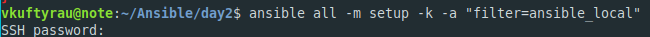
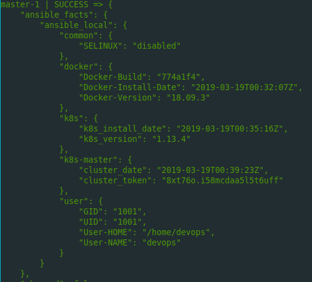
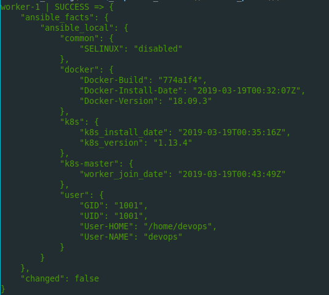
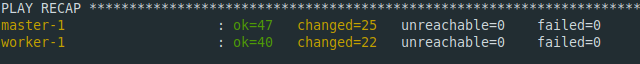
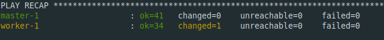

# LAB WORK TASK. DAY 2.

# DEVELOPING ROLES.

## Developing custom roles.

# Task

A) On Control Machine:

**-** Create folder **~/ansible/day2**. All working files should be placed there (Vagrantfile,
    playbooks, roles folder with custom roles, inventory)

B) Spin up 2 VMs form single Vagranfile. Compose Inventory:

**-** Specify groups
**-** Define group vars 
**-** Define host vars
**-** Define ansible connection settings (common for all hosts/groups in inventory)

**inventory:**
```
[all:vars]
ansible_connection=paramiko
ansible_user=root

[masters]
master-1 ansible_host=192.168.56.15
[workers]
worker-1 ansible_host=192.168.56.20
```
**ansible.cfg:**
```[defaults]
host_key_checking = False
display_args_to_stdout = True
retry_files_enabled = False
inventory = inventory
```
C) Develop following Roles:

**- common** (provides common system updates/configuration/so on)
**roles/common/tasks/main.yml:**
```yaml
---
# tasks file for common
- name: Remove swapfile from /etc/fstab
  mount:
    name: swap
    fstype: swap
    state: absent
    
- name: Disable swap
  command: swapoff -a
  when: ansible_swaptotal_mb > 0
  
- name: Disabling SELINUX
  shell: |
    sed -i 's/^SELINUX=enforcing$/SELINUX=permissive/' /etc/selinux/config
  args:
    warn: False
  changed_when: False
  
- name: Installing ntp
  package:
    name:
      - ntp
    state: installed
  notify:
  - common details

- name: SELINUX state
  shell: cat /etc/selinux/config | grep -v -E "#|^$" | grep -w -i 'SELINUX=*'| cut -d '=' -f2
  register: selinux_state
  changed_when: False
  
- name: Swap size
  shell: cat /proc/meminfo | grep SwapTotal| cut -f14- -d ' '| awk '{print $1}'
  register: swap_size
  changed_when: False
```
**- devops_user** (creates “devops:devops” user, updates authorized keys file, configures
    sudoers, disables requiretty setting for this user)
**roles/devops_user/tasks/main.yml:**
```yaml
---
# tasks file for devops_user
- name: Creating user devops
  user:
    name: '{{ new_user }}'
    password: "{{ '{{ new_user_pass }}' | password_hash('sha512', 'mysecretsalt') }}"
    append: yes
  notify:
  - user details
  
- name: UID
  shell: 'id -u {{ new_user }}'
  register: uid
  changed_when: False
  
- name: GID
  shell: 'id -G {{ new_user }}'
  register: gid
  changed_when: False
  
- name: User's home dir
  shell: 'eval echo ~{{ new_user }}'
  register: new_user_home
  changed_when: False
  
- name: Set authorized key taken from file
  authorized_key:
    user: devops
    state: present
    key: "{{ lookup('file', './devops.pem') }}"

- name: Add devops to sudoers
  lineinfile:
    path: /etc/sudoers
    line: '{{ new_user }} ALL=(ALL) NOPASSWD:ALL'
```
**- docker** (base installation and configuration)
**roles/docker/tasks/main.yml:**
```yaml
---
# tasks file for docker
- name: Adding docker repo
  yum_repository:
    name: docker
    description: docker stable
    baseurl: https://download.docker.com/linux/centos/7/x86_64/stable
    gpgkey: https://download.docker.com/linux/centos/gpg
    gpgcheck: yes
    
- name: Enabling Docker Edge repo
  ini_file:
    dest: /etc/yum.repos.d/docer-ce.repo
    section: 'docker-ce-edge'
    option: enabled
    value: 0
    
- name: Installing docker
  package: name=docker-ce state=installed
- name: Enabling Docker
  service: name=docker enabled=yes state=started
  notify:
  - docker details
  
- name: Docker version
  shell: docker -v | awk '{print $3}'| cut -f1 -d ','
  register: docker_version
  changed_when: False
  
- name: Docker build
  shell: docker -v | awk '{print $5}'
  register: docker_build
  changed_when: False
  
- name: Configuring docker
  blockinfile:
    path: /etc/sysctl.d/docker.conf
    block: |
      net.bridge.bridge-nf-call-ip6tables = 1
      net.bridge.bridge-nf-call-iptables = 1
    create: True
```
**- k8s-base** (installs kub packages, depends on docker role with systemd cgroup driver)
**roles/k8s-base/tasks/main.yml:**
```yaml
---
# tasks file for k8s-base
- name: add Kubernetes' YUM repository
  yum_repository:
    name: Kubernetes
    description: Kubernetes YUM repository
    baseurl: https://packages.cloud.google.com/yum/repos/kubernetes-el7-x86_64
    gpgkey: https://packages.cloud.google.com/yum/doc/yum-key.gpg https://packages.cloud.google.com/yum/doc/rpm-package-key.gpg
    gpgcheck: yes
    
- name: Installing k8s
  package:
    name:
      - kubelet
      - kubectl
      - kubeadm
    state: installed
  notify:
  - save k8s details

- name: k8s Version
  shell: kubelet --version | awk '{print $2}' | cut -c2-
  register: k8s_version
  changed_when: False

- name: Enabling kubelet
  service: name=kubelet enabled=yes state=started
  
- name: Enabling ntpd
  service: name=ntpd enabled=yes state=started

- name: Sysctl --system
  command: sysctl --system
  changed_when: False
```
**- k8s-master**
**roles/k8s-master/tasks/main.yml:**
```yaml
---
# tasks file for k8s-master
- name: kube init
  command: kubeadm init --pod-network-cidr 10.244.0.0/16 --apiserver-advertise-address 192.168.56.15
  register: output
  args:
    creates: /etc/kubernetes/manifests/kube-controller-manager.yaml
  failed_when: "'Failed' in output.stdout"
  notify:
  - cluster details
  
- name: Get cluster token
  shell: kubeadm token list | awk NR==2'{print $1}' 
  register: cluster_token
  changed_when: False
  
- name: Setup kubectl
  file:
    path: '{{ ansible_user_dir }}/.kube'
    state: directory
    
- name: adding config
  copy:
    src: '/etc/kubernetes/admin.conf'
    dest: '{{ ansible_user_dir }}/.kube/config'
    remote_src: yes
    
- name: create joincommand
  shell: |
    kubeadm token create --print-join-command > /vagrant/joincommand
  args:
    warn: False
  changed_when: False
  
- name: Apply flannel
  command: kubectl apply -f https://raw.githubusercontent.com/coreos/flannel/bc79dd1505b0c8681ece4de4c0d86c5cd2643275/Documentation/kube-flannel.yml
  changed_when: False
  
- name: w8
  wait_for: timeout=10 
  
- name: Patching flannel
  shell: |
    kubectl patch daemonsets kube-flannel-ds-amd64 -n kube-system --patch='{"spec":{"template":{"spec":{"containers":[{"name": "kube-flannel", "args": ["--ip-masq", "--kube-subnet-mgr", "--iface='enp0s8'"]}]}}}}'
  changed_when: False
```
**- k8s-worker**
**roles/k8s-worker/tasks/main.yml:**
```yaml
---
# tasks file for k8s-worker
- name: Join worker
  command: bash /vagrant/joincommand
  register: output
  args:
    creates: /etc/kubernetes/kubelet.conf
  failed_when: "'Failed' in output.stdout"
  notify:
  - worker join details
```
D) Make sure that all necessary application state changes are being done with **_handlers_** on
demand.
**roles/common/handlers/main.yml:**
```yaml
---
# handlers file for common
- name: common details
  copy: 
    content: >
      {
        "SELINUX": "{{ selinux_state.stdout }}",
        
      }
    dest: /etc/ansible/facts.d/common.fact

  become: yes
```
**roles/devops_user/handlers/main.yml:**
```yaml
---
# handlers file for devops_user
- name: user details
  copy: 
    content: >
      {
        "User-NAME": "{{ new_user }}",
        "UID": "{{ uid.stdout }}",
        "GID": "{{ gid.stdout }}",
        "User-HOME": "{{ new_user_home.stdout }}"
      }
    dest: /etc/ansible/facts.d/user.fact

  become: yes
```
**roles/docker/handlers/main.yml:**
```yaml
---
# handlers file for docker
- name: docker details
  copy: 
    content: >
      {
        "Docker-Version": "{{ docker_version.stdout }}",
        "Docker-Build": "{{ docker_build.stdout }}",
        "Docker-Install-Date": "{{ ansible_date_time.iso8601 }}"
      }
    dest: /etc/ansible/facts.d/docker.fact

  become: yes
```
**roles/k8s-base/handlers/main.yml:**
```yaml
---
# handlers file for k8s-base
- name: save k8s details
  copy: 
    content: >
      {
        "k8s_version": "{{ k8s_version.stdout }}",
        "k8s_install_date": "{{ ansible_date_time.iso8601 }}"
      }
    dest: /etc/ansible/facts.d/k8s.fact

  become: yes
```
**roles/k8s-master/handlers/main.yml:**
```yaml
---
# handlers file for k8s-master
- name: cluster details
  copy: 
    content: >
      {
        "cluster_token": "{{ cluster_token.stdout }}",
        "cluster_date": "{{ ansible_date_time.iso8601 }}"
      }
    dest: /etc/ansible/facts.d/k8s-master.fact

  become: yes
```
**roles/k8s-woker/handlers/main.yml:**
```yaml
---
# handlers file for k8s-worker
- name: worker join details
  copy: 
    content: >
      {
        "worker_join_date": "{{ ansible_date_time.iso8601 }}"
      }
    dest: /etc/ansible/facts.d/k8s-worker.fact

  become: yes
```

E) All roles should leave facts about configured/provisioned software on the system (Verify
system’s configuration with ad-hoc command – setup module - after provisioning)\

**run command**




**master facts**



**worker facts**



F) Develop **provision.yml** playbook:
**-** Sections pre_tasks, tasks, roles, post_tasks
**-** Specify k8s cluster token in playbook, inventory (group vars, host vars), extra vars – try
    different.
**playbook.yml**
```yaml
---
- hosts: all
  pre_tasks:
    - name: Create /etc/ansible/facts.d
      file:
        path: /etc/ansible/facts.d
        state: directory
      become: yes

- name: Common
  hosts: all
  become: yes
  roles:
    - common

- name: Create devops user
  hosts: all
  become: yes
  roles:
    - devops_user

- name: Install docker
  hosts: all
  become: yes
  roles:
    - docker

- name: Install k8s (for all)
  hosts: all
  become: yes
  roles:
    - k8s-base
    
- name: Install k8s-master
  hosts: masters
  become: yes
  roles:
    - k8s-master

- name: Install k8s-worker
  hosts: workers
  become: yes
  roles:
    - k8s-worker
    
- hosts: all
  post_tasks:
    - name: delete joincommand
      file:
        state: absent
        path: /vagrant/joincommand
```
### Provision results:
**1st provision:**



**2nd provision:**




